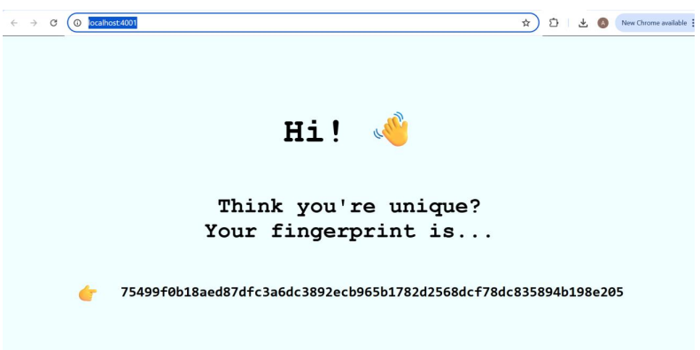
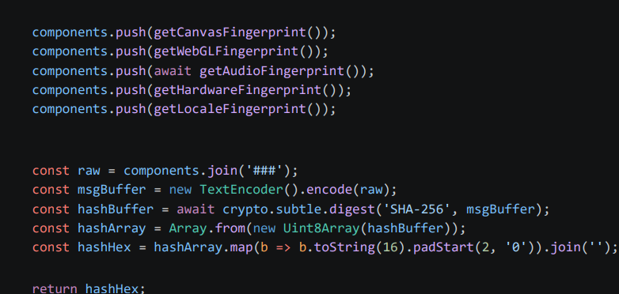

# Browser Fingerprinting — Sample Implementation

## Overview

A sample fingerprinting script using **5 browser vectors** for user identification (University Course Assignment).

**Resulting fingerprint behavior:**
- Returns the same hash across page open/close/reopen
- Returns a different hash per browser type
- Does **not** rely on cookies or localStorage
- Hash remains identical after cookie, cache, and localStorage deletion (tested across all browsers)
- Returns the same hash in Incognito/Private mode

## Vectors Used

| Vector | Method | Rationale |
|---|---|---|
| **Canvas** | Renders an image by drawing onto a `<canvas>` element, then converts it to a string | Chosen because each system and browser renders elements slightly differently |
| **WebGL** | Extracts renderer information and graphics capabilities | Increases fingerprint uniqueness, since graphics hardware differs between devices |
| **Audio** | Generates an audio signal and measures processing differences | Reflects micro-variations in audio processing, increasing fingerprint uniqueness; Blocked by default untill user action. |
| **Hardware & Screen** | Uses RAM and screen information (e.g. resolution) | Stable hardware characteristics that increase uniqueness, since the odds of two devices sharing the exact same combination are low |
| **Timezone & Language** | Adds supplementary data | Further increases fingerprint uniqueness |

## Limitations

The proposed implementation has the following limitations:

- **API dependency** — relies on APIs that can be blocked (Canvas, WebGL, AudioContext)
- **Not 100% constant** — Canvas rendering can be affected by browser updates; minor session-to-session variation is possible for Audio, etc.
- **Device-dependent** — a user cannot be tracked across different devices
- **May fail** when used with browsers that have anti-fingerprinting protections, when the required APIs are disabled/unavailable, or on virtual machines, since these do not reflect real underlying hardware

## Fingerprinting Prevention

One potential defense against fingerprinting with the proposed approach is **fingerprint uniformization**: the browser could manipulate values for screen resolution, timezone, and language, reporting the same values for all users. Blocking APIs such as Canvas, WebGL, or AudioContext would also reduce fingerprint uniqueness.

However, this can degrade user experience, since it limits the functionality available to visited sites.

## Brave Test

In the end I used a testing script to investigate how Brave fingerprint protection affects WebGL fingerprinting. The script evaluates WEBGL_debug_renderer_info,  getSupportedExtensions(), getShaderPrecisionFormat(), getContextAttributes(), Rendered pixel hash and Numeric getParameter() values. 

In the testing environment, the WebGL values observed in Brave were identical to those obtained in Chrome, Edge, and Firefox even with aggressive tracker blocking in place. Therefore, the experiment did not demonstrate effective modification of these WebGL fingerprinting signals in the tested Brave configuration.

Test file: `braveornot.html`