# CTF Writeups - Unbreakable 2026 prep
## Alternating
The challenge provides a rar archive and the following description:
> “We have hidden something in the file and I'm sure you won't find it. Make sure to extract the archive using WinRar. Windows is your friend.”

I downloaded the archive and unzipped it using WinRar. Inside there is a Flag.txt.txt file that appears to be empty.

The name of the challenge along with the clue for usng WinRar suggest the usage of ADS.

I ran the cmd dir/R in powershell in order to discover alternate data streams:

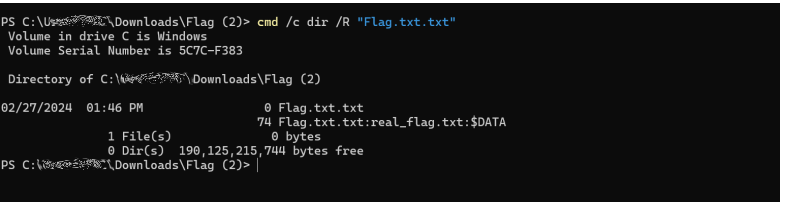

And found there is a real_flag.txt stream inside the Flag.txt.txt file. I then used the “more” command to read data from the stream:

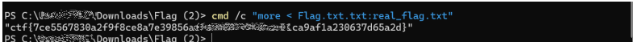

And discovered the flag.

## robots

The challenge provides a service instance and the description “Try Harder!”

When opening the service instance the message “I hope you like robots” appears. So naturally I tried accesing robots.txt
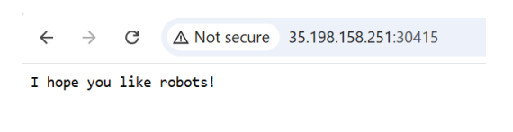

In robots.txt we identify a disallowed page: 

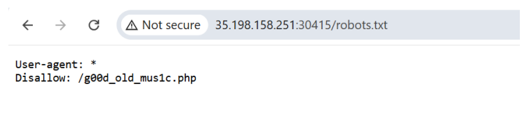
Upon accesing that page, the flag is presented:
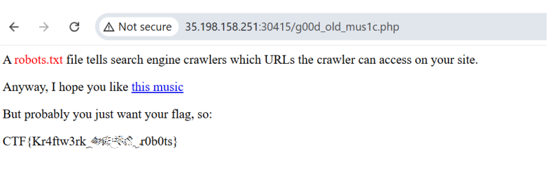

## Injector
Once again we are presented with a service instance and the description “Try harder!!”

When accessing the page we see we get a ?host=127.0.0.1 get query in the url
and the text: “command executed ping... “
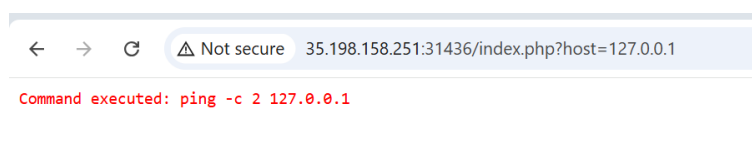

So if we add “;ls” after the IP we are able to see the contents of the current
folder, where sure enough a flag.php file is available:

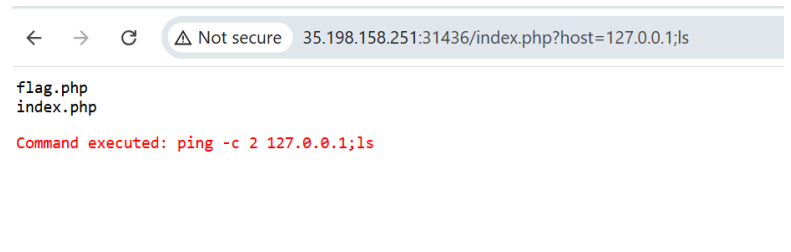
So instead of ls, we can use cat flag.php in order to read it’s contents:

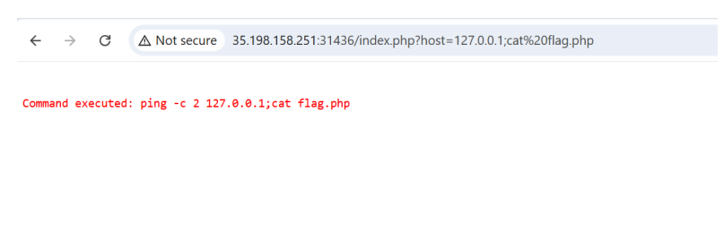

Upon inspecting the source of the page we see the flag commented out:
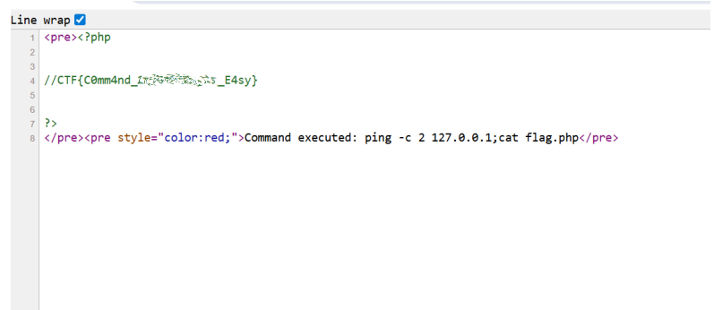

## BBBBBBBBBB

This challenge presents an archive called chall-zip-in-zip.zip, and the description reads:
> “BBBBBBBBBB BBBBBBBBBB BBBBBBBBBB BBBBBBBBBB BBBBBBBBBB BBBBBBBBBB BBBBBBBBBB BBBBBBBBBB BBBBBBBBBB BBBBBBBBBB BBBBBBBBBB BBBBBBBBBB BBBBBBBBBB BBBBBBBBBB BBBBBBBBBB BBBBBBBBBB BBBBBBBBBB BBBBBBBBBB”

Unzipping the archive reveals a chall.jpg but trying to open it with a photo viewer results in an erorr:

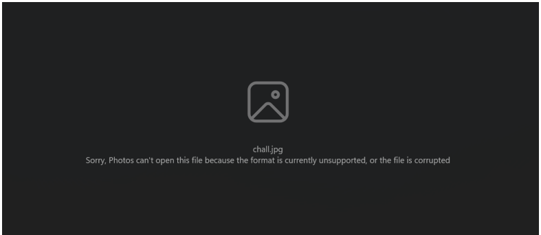

Running strings shows there are a lot of BBBBBBBBBB characters in the file:

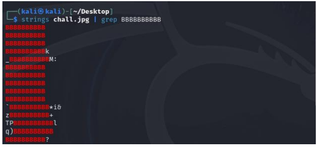

I used sed to remove the substrings:
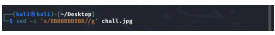

And the image with the flag opens:
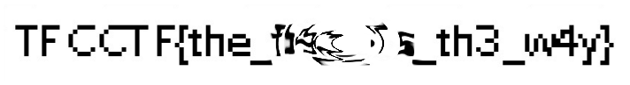

## Random

In this challenge we are presented with a “main” file of type application/octet-stream and a service instance. The challenge description reads “Get the flag, is more easy!!”

After downloading the file we run the Get-Content .\main -Encoding Byte | Format-Hex command to inspect the file and get the following result:
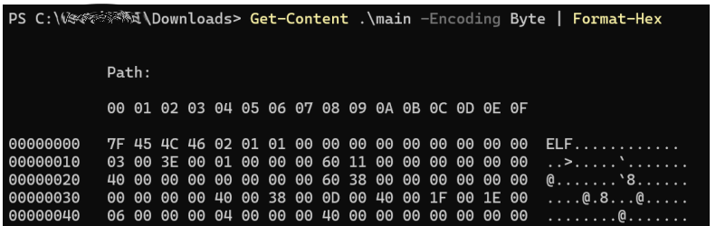

So we know it is an .elf file. I used ghidra to decompile the file and inside the main function we get this interesting block:
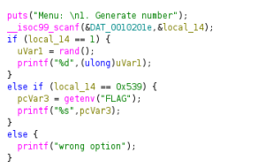

The function seems to return the flag if the input is 0x539 (1337 decimal). Next let’s connect to the service using netcat:

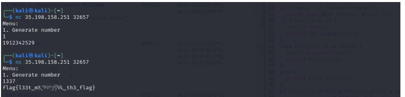

## Web intro

For this challenge we are presented with a service and the description: 
> “Are you an admin? Note: Access Denied is part of the challenge. Flag format: CTF{sha256}“

So we access the service via browser and get Access Denied:

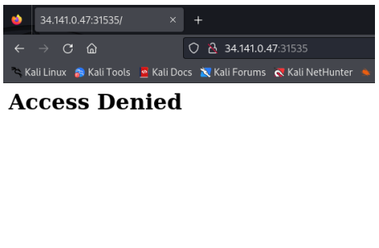

Inspecting the reuqest reveals an interesting cookie:

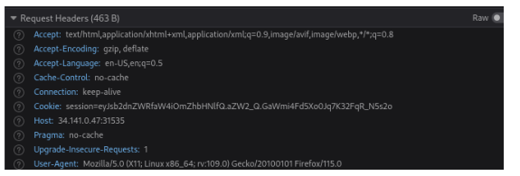

If we use base64 to decode the string, we get {logged_in:false}

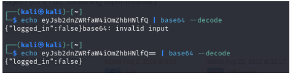

Next I used flask_unsign to decode the cookie and brute force the secret:

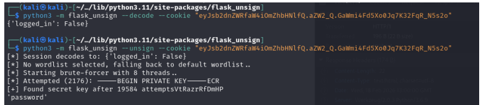

I then used flask_usign to sign the cookie with the secret:

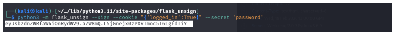

I used the cookie editor firefox plugin and modified the session cookie value:

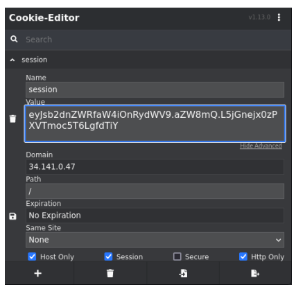

And got the flag:

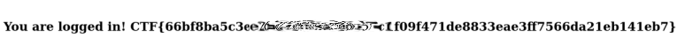

## SEE

The challenge offers a photo and the description:
> If you can see it, you might just retrieve it! Flag format: CTF{sha256}

In the photo you can see the beginning of the flag:

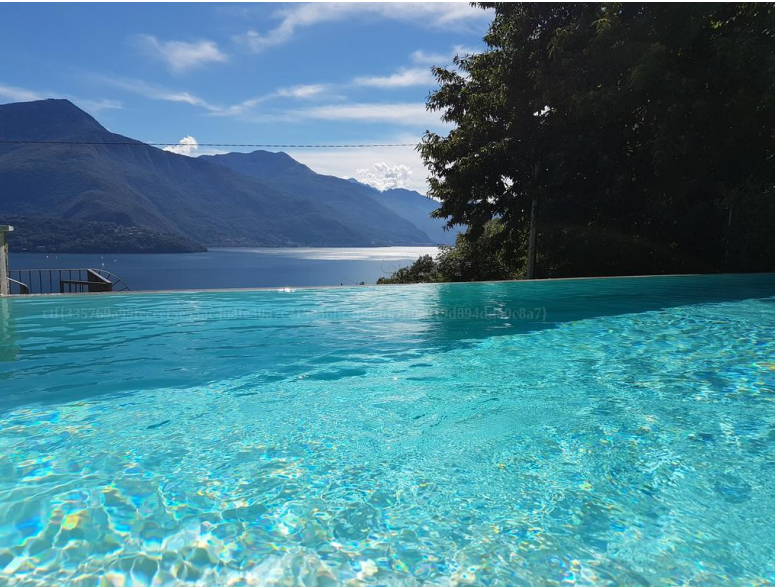

First we confirm it is an image 
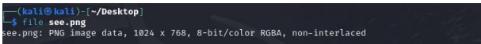

We further explore it with exiftool:
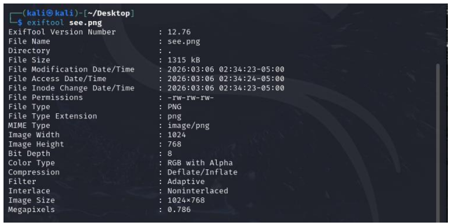

First i tried stegsolve, but the flag is not entirely readable:
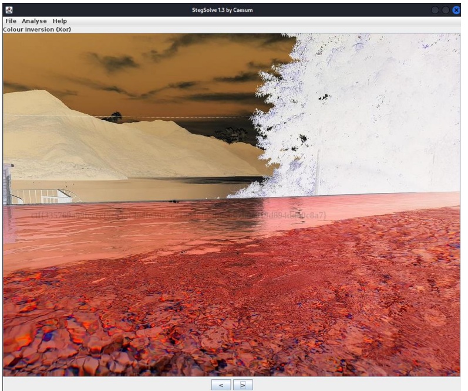

Next i tried imagemagick with no success:
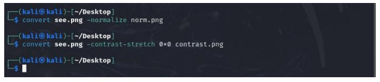

Next tried enhancing in gimp but without success:
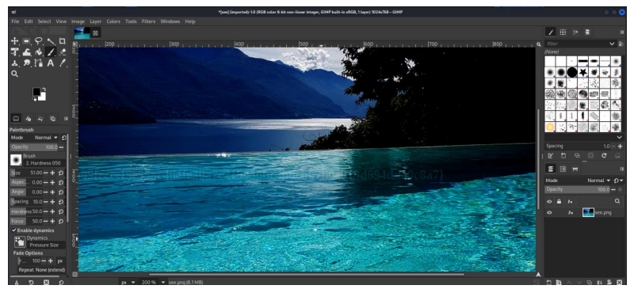

Next i tried zsteg:

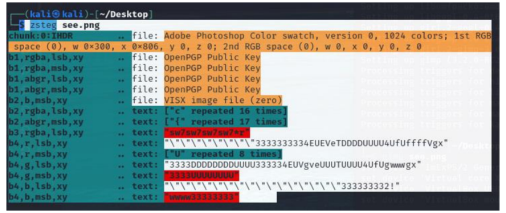

Channel separation revealed a bit of the flag:

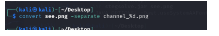

On channel 0 (red) we can start to see the details in the flag:
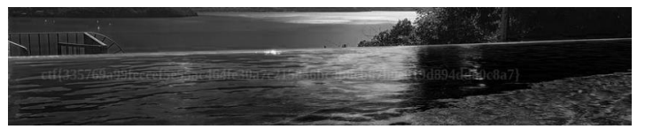

Next with normalize i managed to enhance even more:

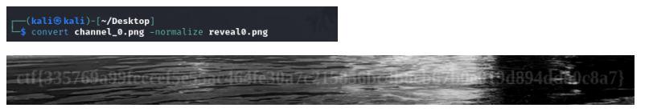
and with some trial and error we get the flag.

##Phpwn:
> Free note taking app! Automatic backups every minute included in free tier!

Source code:

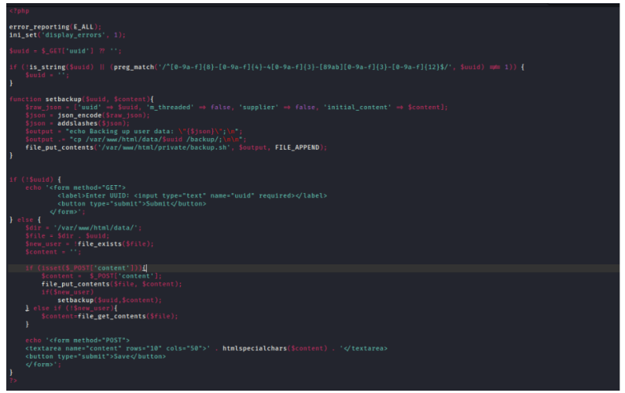

In the interface we provide an UUID that follows the convention

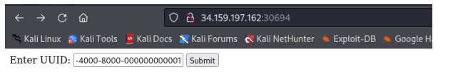

We reach the final point where an error is displayed:
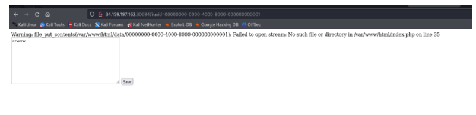

Accessing /private/backup.sh reveals the following:
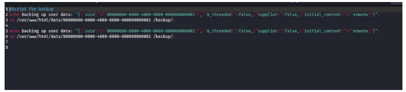

So we must provide a payload that copies /tmp/flag in var/www/html/flag.txt, wait a minute and should be able to retrieve it. However, add slashes modifies the payload:

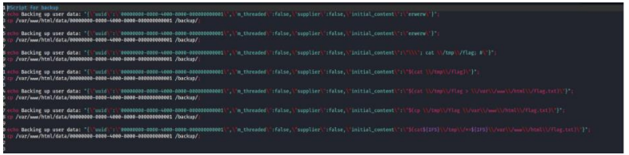

We try with backticks

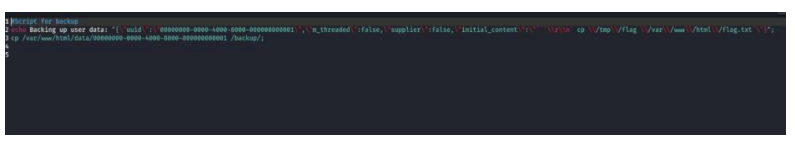

Change user id and try with ${IFS}

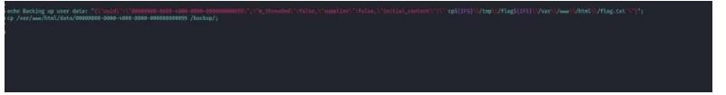

Try in base64 `echo Y3AgL3RtcC9mbGFnLnR4dCAvdmFyL3d3dy9odG1sL2ZsYWcudHh0|base64 -d|bash`

Check the formatting is correct in backup.sh

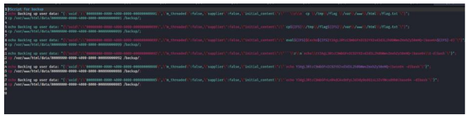

And after a minute, we get the flag:
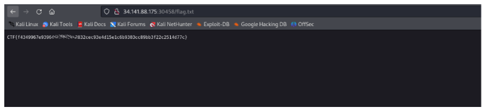

