# Investigating the behaviour of a keylogger - ZEUS

## Introduction
Zeus has produced millions of dollars in damage by stealing banking information and authorizing transactions from computers all around the world. In 2009, there were 3.6 million infections in the US alone. This malware has the ability to alter webpages and record keystrokes and has later evolved to target mobile users by means of intercepting mobile transaction authentication numbers delivered via SMS. Furthermore, it uses randomization techniques to avoid hash detection. 

 ## Literature overview
 One work that captured my attention was K. P. Grammatikakis, I. Koufos, N. Kolokotronis, C. Vassilakis, S. Shiaeles - Understanding and mitigating banking trojans: from Zeus to Emotnet published in 2021. The authors attempt a comparison between Zeus and Emotnet (a moder day banking trojan). They have set up a simulated environment with complex topology and tested the effectiveness of an iIRS solution with promising results. 

A second work consulted before elaborating this plan is A. Padele, K. Gottumukkala, K. S. Pendyala - Digital forensic analysis of malware infected machine: case study published in 2015. In this work the authors analyze an incident that lead to a $600.000 loss for one banks client and list valuable insights on the behavior of Zeus.  

Lastly, A. Mohaisen. O. Alrawi - Unveiling Zeus - automated classification of malware samples attempt behavior based model training using human curated data for identifying Zeus. The best results they obtain are via SVM. This work also provides insights on the malware's behavior. 

None of the works listed above do, however, contain static analysis of the malware. Given that packers continually evolve in order to evade hash detection and that, more that 15 years have passed since the discovery of the malware, yet it still remains active, a both static and dynamic approach in analyzing it's behavior might prove valuable today. 

## Static analysis
The first step was extracting information about the file using both the online cuckoo.cert.ee sandbox (https://cuckoo.cert.ee/analysis/7297441/summary/) and PEStudio: 

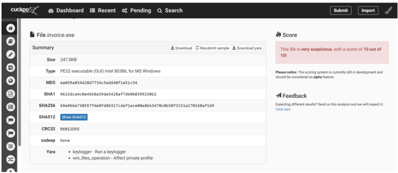

The file appears to be suspicious, with a score of 10 out of 10.

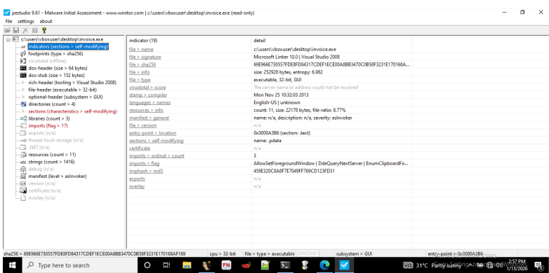

Original File Name: **invoice_2318362983713_823931342io.pdf.exe**
Note: For convenience I renamed the file to invoice.exe
MD5: **ea039a854d20d7734c5add48f1a51c34**
SHA1: **9615dca4c0e46b8a39de5428af7db060399230b2**
SHA256:
**69e966e730557fde8fd84317cdef1ece00a8bb3470c0b58f3231e170168af169**
Type: **executable, 32-bit**
Size: **252928 bytes/247 KB**
Entropy: **6.982**
Used Libraries: **3**
Imports: **77**
Compiler Timestamp: **25.11.2013 10:32:03**

Next, I took the SHA256 hash and searched for it on VirusTotal. The suspicions are confirmed by the search with 63/72 vendors listing the file as suspicious:

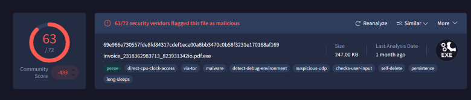

In the following phase I focused my efforts on four main objectives:
- Discovering whether the PE copy is packed or otherwise obfuscated
- Investigating the capabilities of the PE
- Which IOC and further information can be found
- Describing working program particularities.

Two methods were used for determining whether the file is a packer or not. The first one is the comparison between the virtual and raw sizes of the sections:

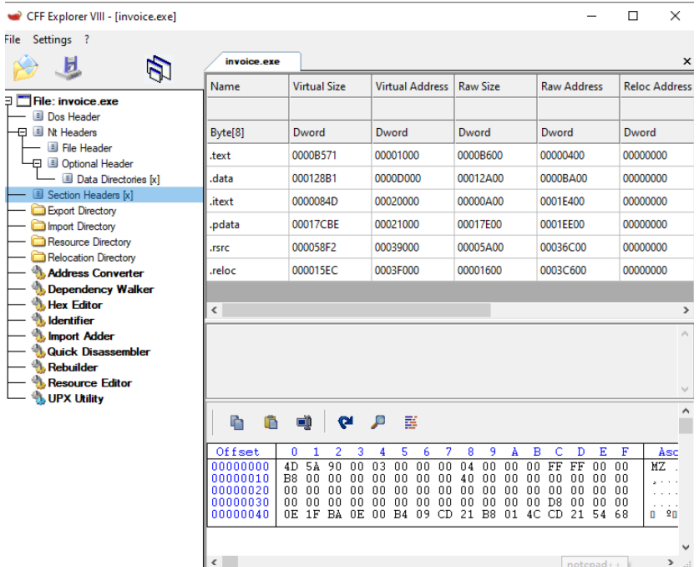

Here we see that for .text, the virtual size is 0xB571 and the raw size is 0xB600 and for .data is 0x128B1 for the virtual size and 0x12A00 for the raw. After converting these values to decimal and calculating their differences, I found that for .text the difference is 143 bytes and for .data is 335 bytes (0.13% of the total size of the program).

The second method was inspecting the program with PEID from the Flare suite:

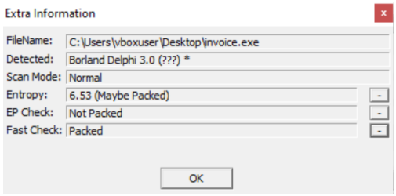

Here the information obtained is conflicting: the complier is determined as Borland Delphi, with low confidence, correct since we know Zeus is php based. The entropy is relatively high (6.53), but smaller than the 6.9 calculated by PEStudio and greater than the 6.16 calculated by Cuckoo Sandbox, the Entry Point seems to be not packed, but the Fast scan says it is packed.

Next set objective was the capabilities analysis, conducted with the use of the capa invoice.exe command. This has revealed three important aspects of this particular file:

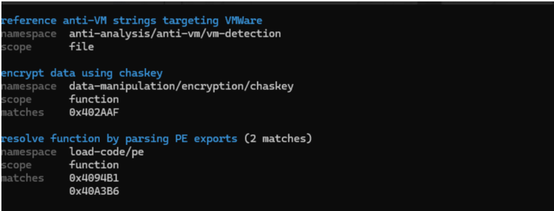

First: it implements evasion techniques targeting VMWare, encrypts data using chaskey and implements API call obfuscation by dynamically calling functions from the PE export table.

In order to discover further information about the file, I used the strings invoice.exe > stringszeus.txt command. This has revealed interesting information such as a domain, library names, API names, some long concatenated strings (probably used for mutex) and the manifest:
corect.com
USER32.SetDlgItemTextW
ZetaBeduPirnhipsjailTingSrisTeleAposhuskNameHoerflagemuwo
SetCurrentDirectoryA
USER32.dll
<?xml version='1.0' encoding='UTF-8' standalone='yes'?>
<assembly xmlns='urn:schemas-microsoft-com:asm.v1' manifestVersion='1.0'>
 <trustInfo xmlns="urn:schemas-microsoft-com:asm.v3">
 <security>
 <requestedPrivileges>
 <requestedExecutionLevel level='asInvoker' uiAccess="false"/>
 </requestedPrivileges>
 </security>
 </trustInfo>
</assembly>

The proportion of discernable strings is very low in the generated file. I used floss in order to try and decode some of the strings, and even though floss reported 33 decoded strings, these are still not human readable:

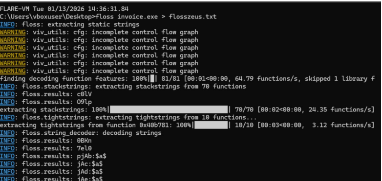

In order to better understand the particularities of the program, I took a look at the libraries the program uses:

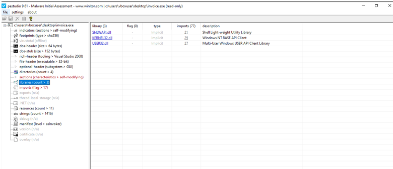

It appears it uses SHLWAPI.dll - a lightweight shell utility used for comparing strings, URL and path handling, and more importantly registry manipulation and shell functions.
The next is KERNEL32.dll, a core windows library used for process, system, memory and file operations.
Lastly, USER32.dll is used for altering GUI and interaction with the user input.

Next, I analyzed the imported APIs, a total of 77 out of which 17 are flagged:

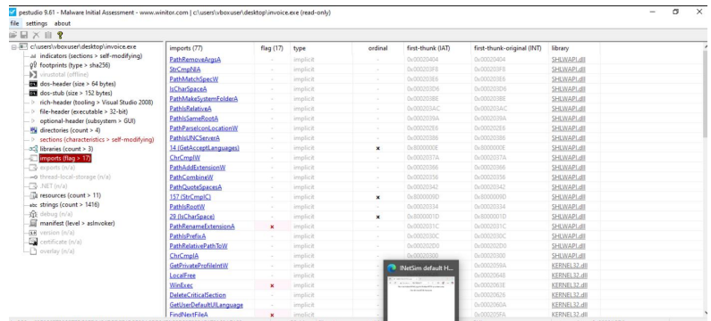

The flagged APIs are (grouped by library):
SHLWAPI.dll: **PathRenameExtensionA**
KERNEL32.dll: **WinExec**
**FindNextFileA**
**GetEnvironmentVariableA**
**GetConsoleAliasExesLengthW**
**WriteFile**
**VirtualQueryEx**
**GetCurrentThread**
**GetEnvironmentVariableW**
**GlobalAddAtomA**
USER32.dll: **GetClipboardOwner**
**GetClipboardData**
**GetAsyncKeyState**
**EnumClipboardFormats**
**DdeQueryNextServer**
**VkKeyScanA**
**AllowSetForegroundWindow**

Some interesting such APIs are:
USER32.dll: **getCaretPos**
**DestroyCursor**
**GetScrollInfo**
**GetCapture**
**ShowCaret**
**LoadBitmapA**
**DeleteMenu**
**HideCaret**
**GetWindowTextLengthW**
**SwapMouseButton**
**GetClipboardOwner**
**GetClipboardData**
**GetAsyncKeyState**
**EnumClipboardFormats**
**AllowSetForegroundWindow**
SHLWAPI.dll: **PathRenameExtensionA**
KERNEL32.dll: **WinExec**
**setCurrentDirectoryW**
**CreateFileMappingA**
**GetCompressedFileSizeA**
**SizeOfResource**
**getTickCount**

In terms of resources, the file includes ten cursors and the manifest. 
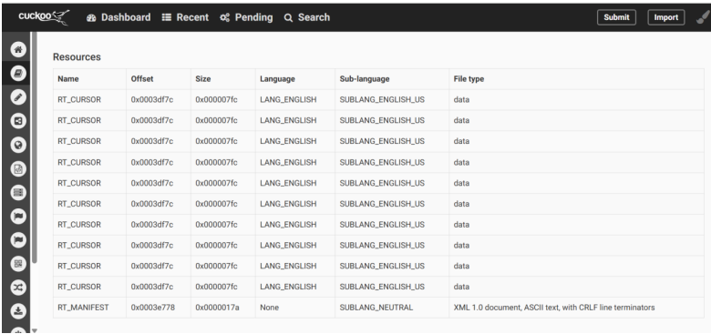

I used Resource Hacker to preview the cursors. They have various sizes, ranging from 24x24 to 30x30. They do look like random bitmaps.

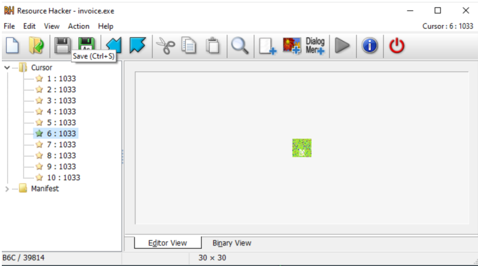

One mention in the manifest is that the usage of requestedExecutionLevel “asInvoker” is meant to prevent the Run as Admin dialog.

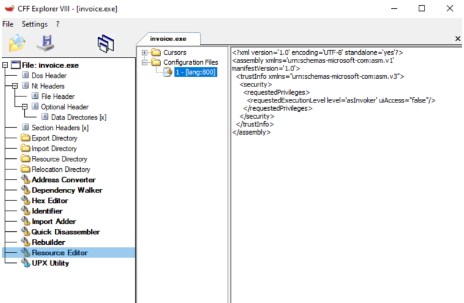

## Dynamic analysis
Before execution, I started Inetsim, FakeDNS and Wireshark in Remnux and Procmon and Wireshark in Flare.
The objectives for this part of the project are:

- Observing Malware behavior and impact in the GUI
- Gathering network proof of C2 communication

After that I double clicked invoice.exe and after a few seconds a popup appears prompting to update Adobe Flash Player. Interesting is that if No is chosen, after approximately 5 seconds, the prompt appears again. 

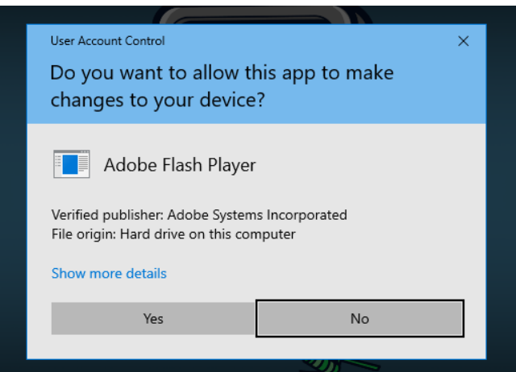

When finally clicking Yes, a fake Adobe Flash Installer appears on the screen, and the malware deletes the executable. 

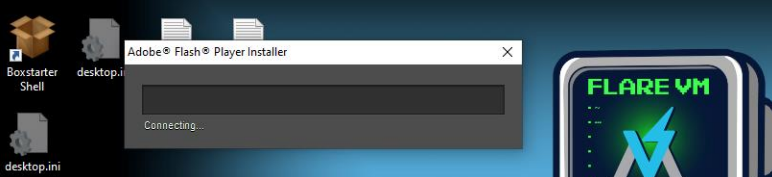

In Process Monitor we can see the invoice.exe process is active with it’s subprocesses. 
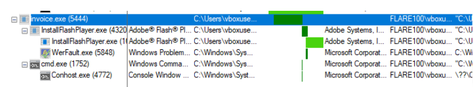

Next, I filtered the processes to identify the persistence mechanisms of the sample, by analyzing Registry Entries created by it. 

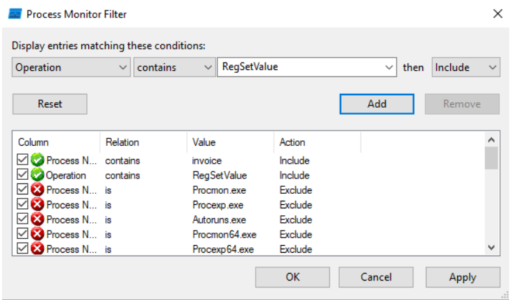

There are 23 such entries, and the first one is on Google Chrome update, ensuring the process is persistent.

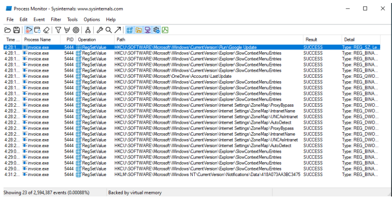

In Event Properties we can see it uses the cryptbase.dll for encrypting the payloads before sending them to the C2:

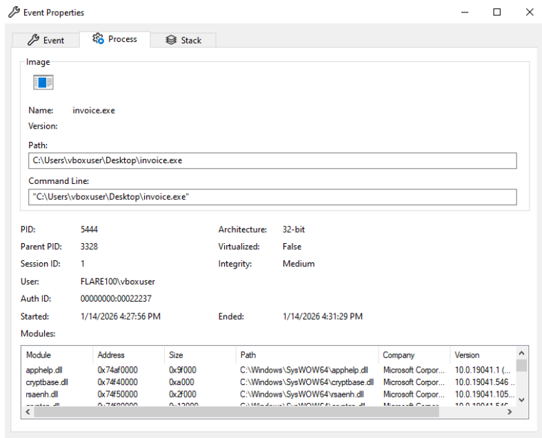

Comparison of the machine state before and after infection highlights the following differences:

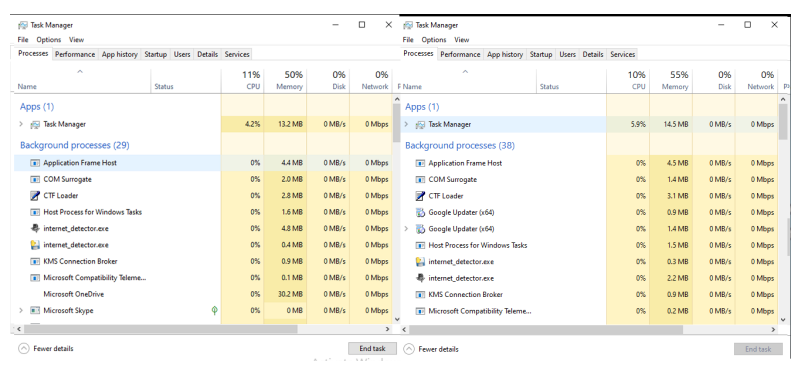

Processes: **no significant impact on CPU, Memory, Disk or Network.**
Startup: **no change in start up apps**
Services: **no significant changes in services**
Resource Monitor: **Two additional processes appear suspended: ShellExperienceHost.exe and a second SearchApp.ex**

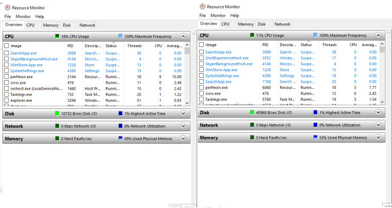

### Wireshark
In order to gather proof of external communication, I opened text-bank.local/login. Since InetSim and Fakedns are active in Remnux, the default inetsim page appears.

I have altered the page to include a simple login form and submitted it multiple times while monitoring the traffic

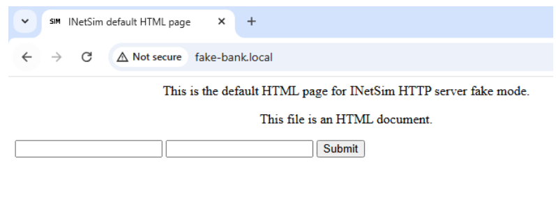

The logs in both Flare and Remnux show the same thing: the request is passed normally, without any unusual traffic.

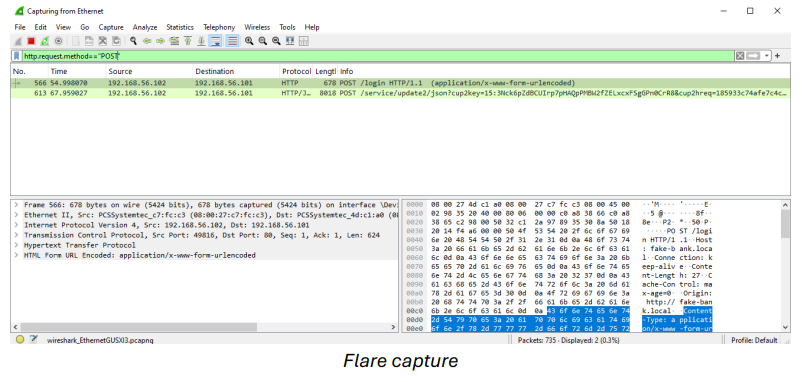

The second request is to a legitimate update.googleapis.com host.
The logs were also examined in terms of dns, ssl and http filtered traffic, uri anomalies such as "gate.php" or random strings, and no evidence of C2 communication was discovered.

## Conclusion
The static analysis part has provided valuable insights for the sample. Even though the differences between the virtual and raw sizes are small, the high level of entropy and identified compiler suggest the PE copy is packed.

The program has anti VM capabilities and implements API call obfuscation. However, string analysis has identified notable APIs being used from three libraries. Imports from the user32.dll library are relevant for the keylogger behavior.

The dynamic analysis phase has shown that the process is masked as a legitimate Adobe Flash Player update and implements persistence mechanisms. There is no significant impact on the performance of the host. 

Network analysis could not prove C2 communication, even when a form with login information was submitted multiple times.

### Bibliography
1. Joshua Saxe, Hillary Sanders, Malware data science attack detection and
attribution, San Francisco 2018, ISBN-10: 1-59327-859-4
2. K. P. Grammatikakis, I. Koufos, N. Kolokotronis, C. Vassilakis, S. Shiaeles -
Understanding and mitigating banking trojans: from Zeus to Emotnet, 2021
3. A. Padele, K. Gottumukkala, K. S. Pendyala - Digital forensic analysis of malware
infected machine: case study
4. A. Mohaisen. O. Alrawi - Unveiling Zeus - automated classification of malware
samples
5. https://github.com/uruc/Malware-Analysis-Lab
6. https://www.scribd.com/document/837424611/jhewjh
7. Hex to Decimal Converter