# Exercise 005 
## Problem statement 

In this exercise we are given a screenshot for a zoo live cam, showing two polar bears sitting in an enclosure. We are told that the picture was taken on 15th January 2023 at approximately 2 PM. 

  

The required tasks are: 

- Finding out where the polar bears are 

- Finding out the temperature at the given time 

- Finding the exact coordinates of the location where the bears sit. 

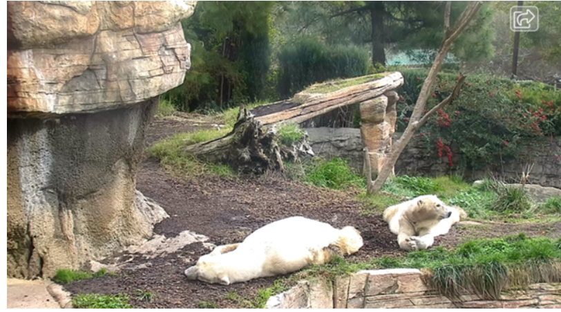
### Task 1 – Finding out the Zoo 

The problem statement offers a clue as where to start looking for the answers: Searching for zoos that have a live webcam of polar bears. I searched google with "polar bear zoo webcam” and found out some results:
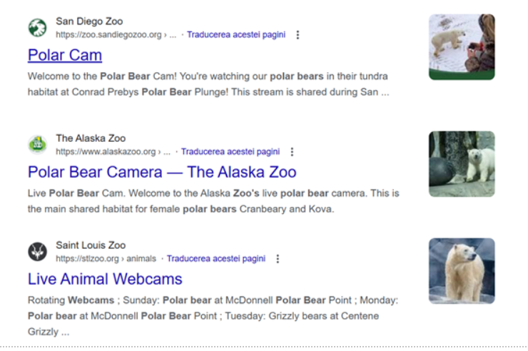
The Alaska Zoo webcam screenshot looks like it may match the color scheme of the shot, but the webcam image does not look similar to the habitat in the given picture:  

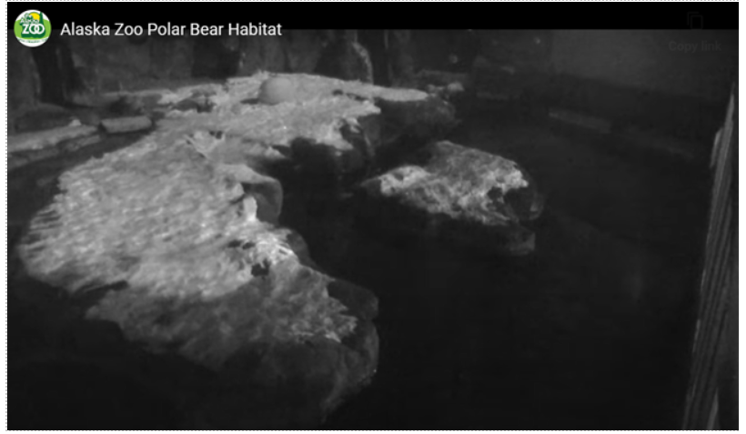
The Saint Louis Zoo polar cam is only available on Sundays (which makes it a good candidate since January 15, 2023 was a Sunday), so it could not be accessed at the time of completing this exercise. 

 

The San Diego Zoo cam, strongly resembles the given image: 
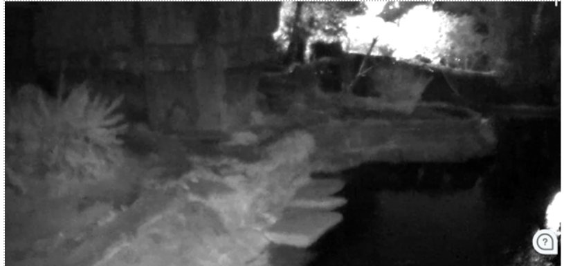
The texture of the rock wall, the shape of the basin and the tree trunk look are the similarities that I’ve found: 
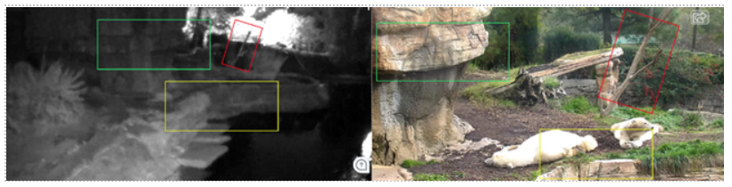
I decided to expand the search with image results, in order to confirm that this was, in fact, the zoo where the picture was taken. This led me to discover this Pinterest post https://www.pinterest.com/pin/355010383132464667/ 

 

 

The image in the also displays similarities with the exercise picture, and the color tones seem very similar.  
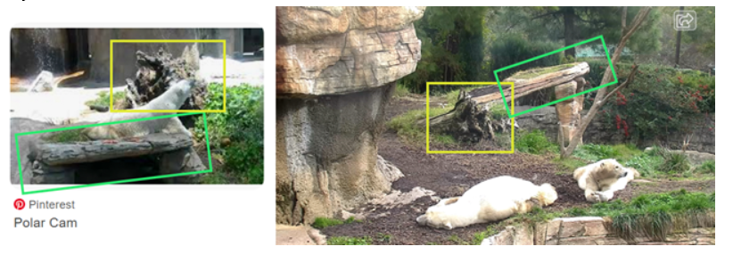
In order to test the color theory, I compared both image histograms in RGB and LAB: 
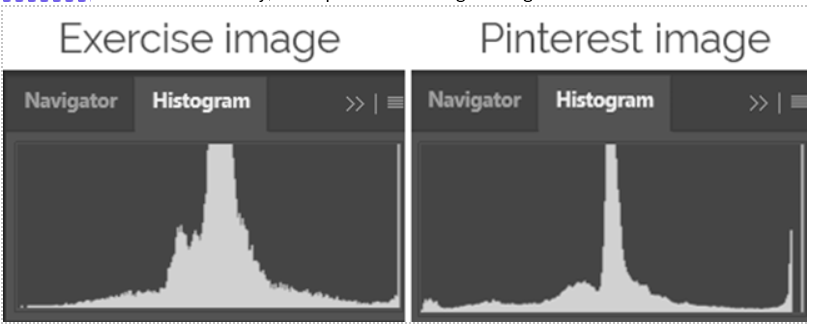
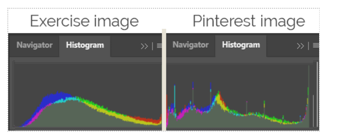
For the first step, I used the image tool available at https://www.iloveimg.com/ - to crop the pinterest image so that it only contains the photo (not the surrounding white frame), and to convert the exercise image to jpg.  

 

The histograms show that the images have coinciding mid-tones, with the Pinterest image having more highlights than the exercise one. Overlapping of the histograms shows that the colors coincide almost perfectly, which can prove that the images were taken in the same place. 

 

Searching for the Zoo on Google maps, we found out that the name of the section is the “Polar Bear Plunge”: 
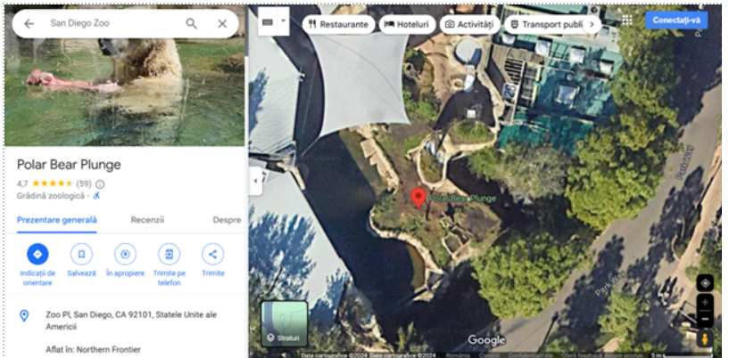
The answer to question number 1 is: The San Diego Zoo, Polar Bear Plunge 

 

 

### Task 2 – Finding out the temperature 

We know that the screenshot was taken in January 15, 2023 at around 2PM. In order to determine the temperature, I searched for “San Diego weather 2023” and selected the first two results in order to get the value of the temperature from one source, and then validate it with the second source: 
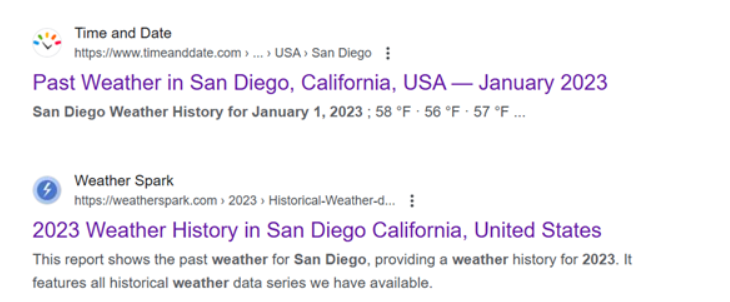
The first website shows a graph with hourly temperatures in the given date: 
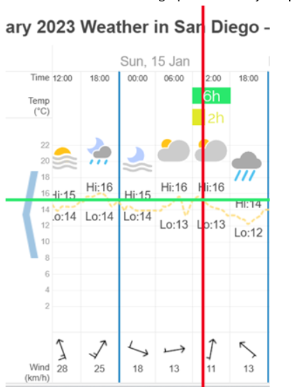
In order to get a value as close to reality as possible, I used Photoshop to get the width of the 6 hours interval (the green box), then duplicate that and divide by 3 in order to get the width of a two hour interval, then sectioned the graph to get the data: timeanddate.com reports approximately 16 degrees Celsius for that location, date and time. 

 

Weatherspark.com reports a temperature a bit above 16 degrees for that date and time: 
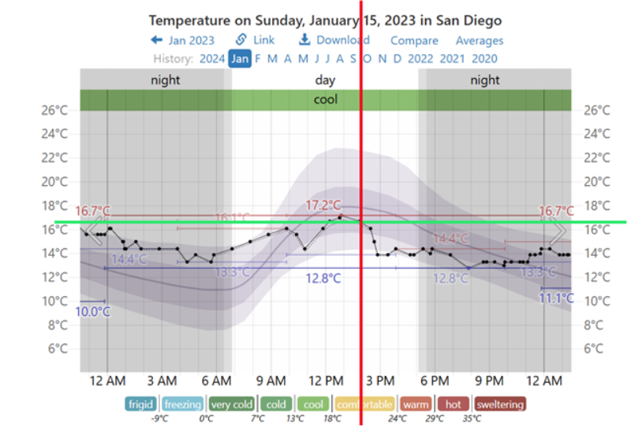
In conclusion, the answer to the second question is: 16 degrees Celsius. 

 

### Task 3 - Finding the coordinates of the bears’ location 

In order to find the exact coordinates, I went through images from the Google Maps Listing, trying to find a picture of the exact spot where the polar bears are located. With this image, I wanted to check the EXIF data, to see if GPS coordinates are available. This led me to find this image:
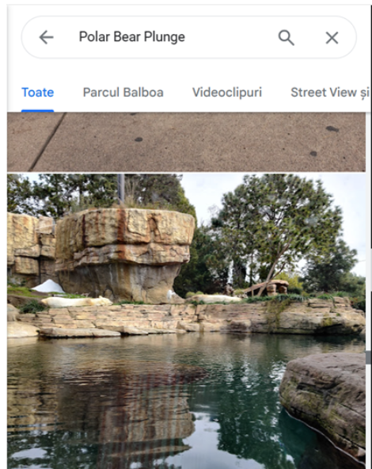

In order to retrieve the exact image file, I used the sources tab to get the address of the image on the Google Server: 
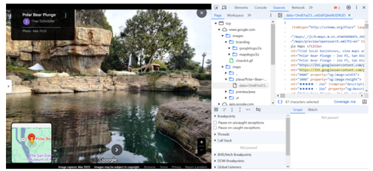
And copied the path from the meta information. I then used JIMPL.com to read the exif data and see if GPS information is available.  

 

Unfortunately, it was not, but we now know that this picture was taken on March 05, 2023 13:25. 

 

I repeated the process with another picture, but with the same results. 

Since this method did not provide information, I returned to the Google Maps listing and compared the map to the exercise image: 
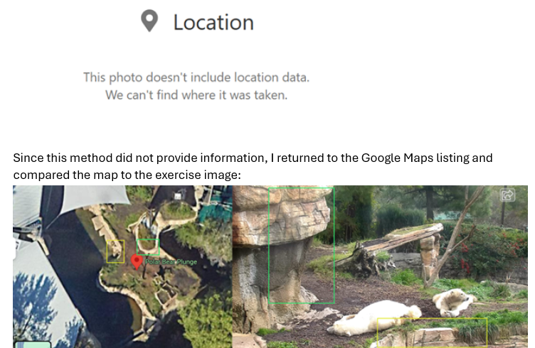
After establishing the area where the bears must have been, I opened the context menu in order to get the coordinates of the location and got these results: 

Bear 1 (closer in the exercise photo): **32.73446419922009, -117.15459374979712**

Bear 2: **32.734455738335676, -117.1545950909016**

 

Tools: 

Google Search 

Google Maps 

Google images 

Adobe Photoshop 

https://zoo.sandiegozoo.org/cams/polar-cam 

www.timeanddate.com 

www.weatherspark.com 

www.jimpl.com 

www.iloveimg.com 

https://sisik.eu/histo