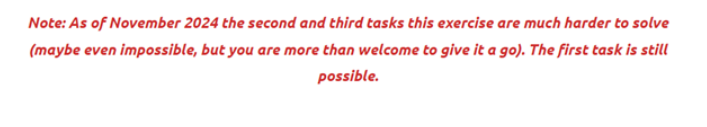
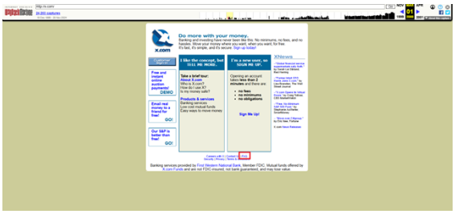
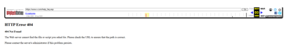
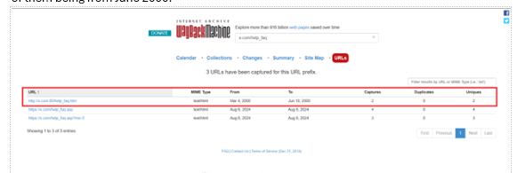
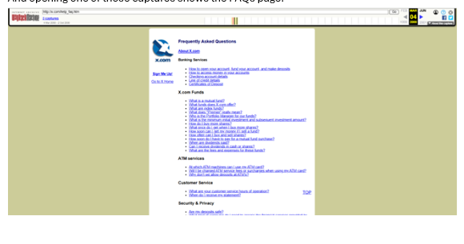
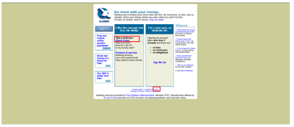
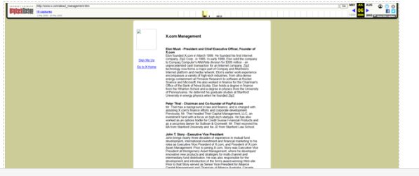

# Exercise 020 

## Problem statement 

 
For this exercise, the first task is rather unusual: finding the exercise page itself

The next two tasks require finding snapshots of the x.com website, dating back from 2000. 

 

Additionally, the exercise page includes a notice, effective as of November 2024: 

### Task 1 - Finding the exercise 

 

Since the exercise banner does not have an anchor to the exercise page, my first try was to modify the link from another exercise to point to “osint-exercise-020”. This lead me to this page: 

he underlined text after the illustration is not an anchor either, but the error message provides a clue for the starting point.  

Next, I opened the Wayback Machine website and searched for the url for this exercise. A capture from August 2023 contained the page with the exercise:

### Task 2 - Finding the FAQ page on the x.com website 

Using the Wayback Machine I was able to view a capture of the x.com webpage in March 2000. In this capture, there is a link to a FAQ page: 

However, clicking it shows a 404 Error page:

We can, however observe, that the URL for the page is help_faq.asp. For the next step I used the URLs tab and searched for “x.com/help_faq” - This query has returned 3 results, with one of them being from June 2000: 

And opening one of those captures shows the FAQs page: 

### Task 3  - Finding the management team as of July 2000 

 

For this step I searched for x.com again, and selected a snapshot from July 2000. From here I clicked the About Us link:  

And found the list of members in the management team:

The complete list of members is:  

 - **Elon Musk** - President and Chief Executive Officer, Founder of X.com 

- **Peter Thiel** - Chairman and Co-founder of PayPal.com 

- **Dave Johnson** - Chief Financial Officer 

- **Kathy Donovan** - Chief Credit Officer 

- **Sanjay Bhargava** - Vice President, ePayments 

- **Mark Sullivan** - Vice President, Operations 