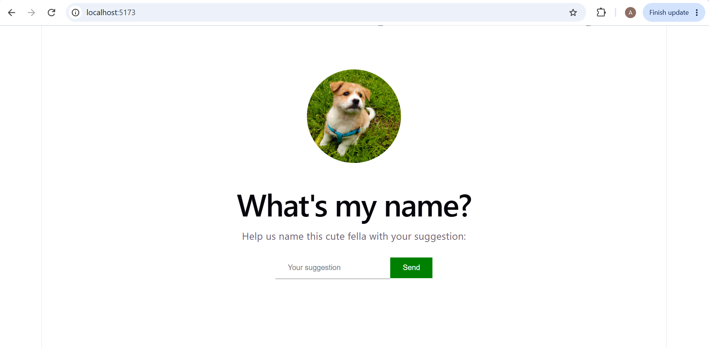
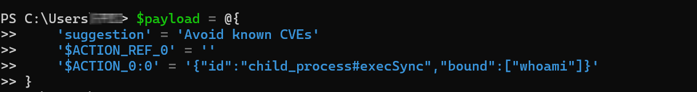
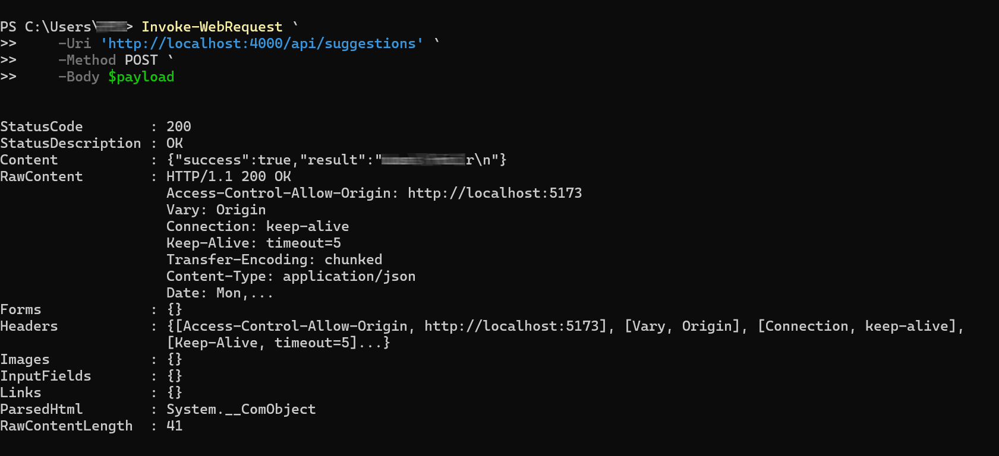
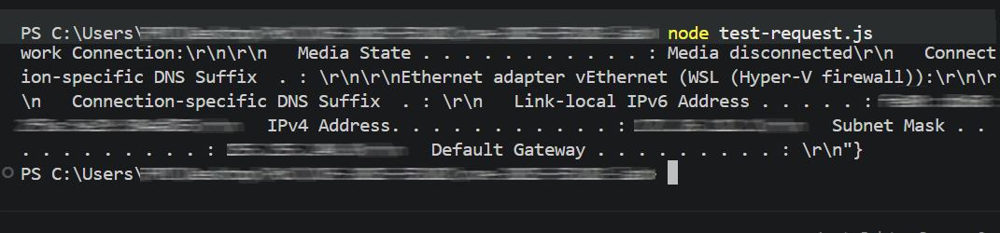

# CVE 2025-55182 PoC

**CVE-2025-55182**, also known as React2Shell, is a critical vulnerability in React Server Components, with a CVSS score 10.0.

Yhe vulnerability is caused by the unsafe deserialization of HTTP request data sent to React Server Function endpoints, data that can result in arbitrary code execution. The vulnerability was discovered by Lachlan Davidson and was reported in a Meta Bug Bounty program on November 29, 2025.

## The mechanism

1. identify the Server Function
2. decode its arguments

`const action = await decodeAction(formData);` 

3. return a callable action
    
`const result = await action();`

When called with:
`'$ACTION_REF_0' = ''` -> tells the decoder there is an associated action in this request
`'$ACTION_0:0' = '{"id":"child_process#execSync","bound":["whoami"]}'`  -> this serialized data is decoded: id is interpreted as module/export server refference, while bound gets interpreted as the function argument; the resulting command is equivalent to `require("child_process").execSync("whoami")`;
The command is executed on the server.
     
## Proof of Concept
For the proof of concept I created a small form whose function is to record name suggestions for a pet:

When submitting the payload above via Invoke-WebRequest, we can see the result of the command in the server response;

Similarly, we can use the test-request.json file provided in the lab to test the output of another command:

